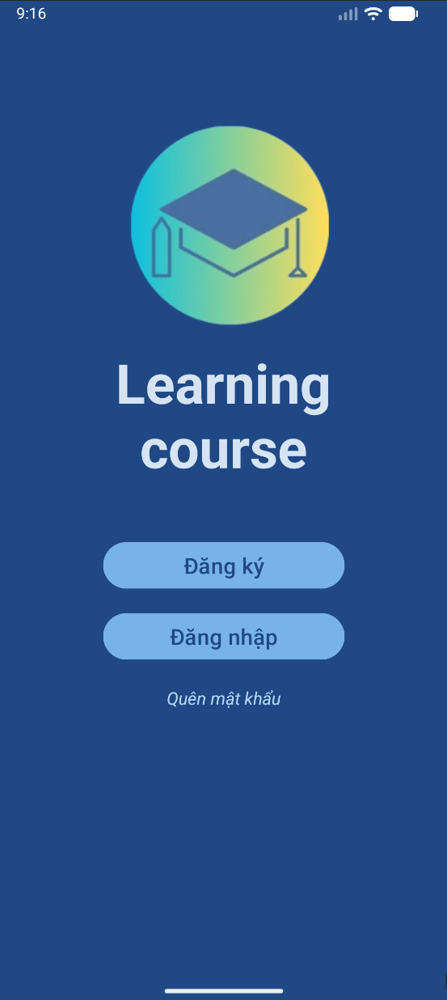
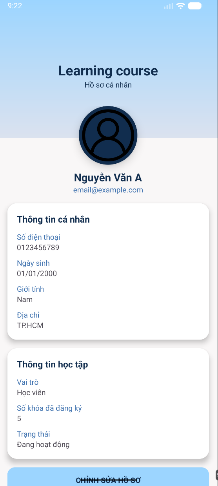
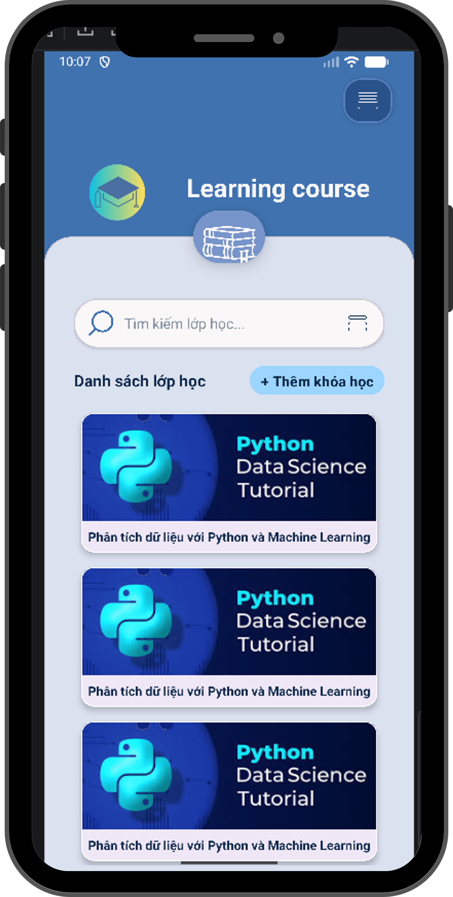
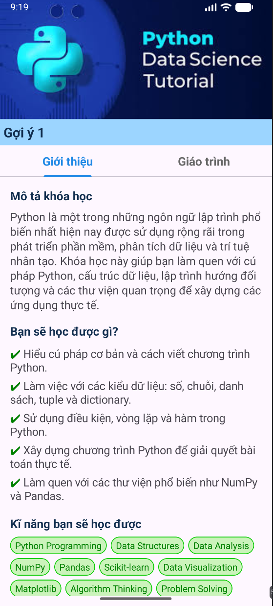
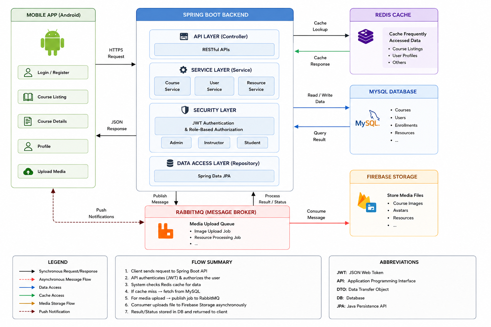
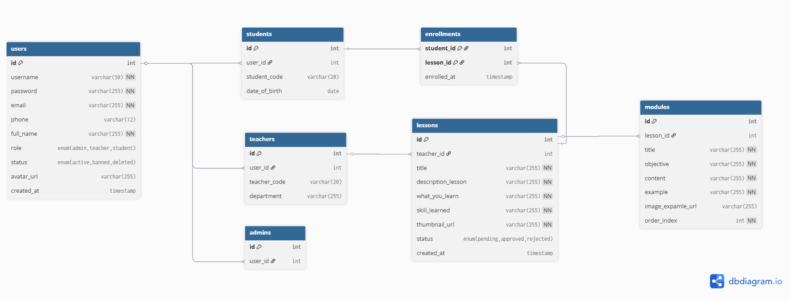
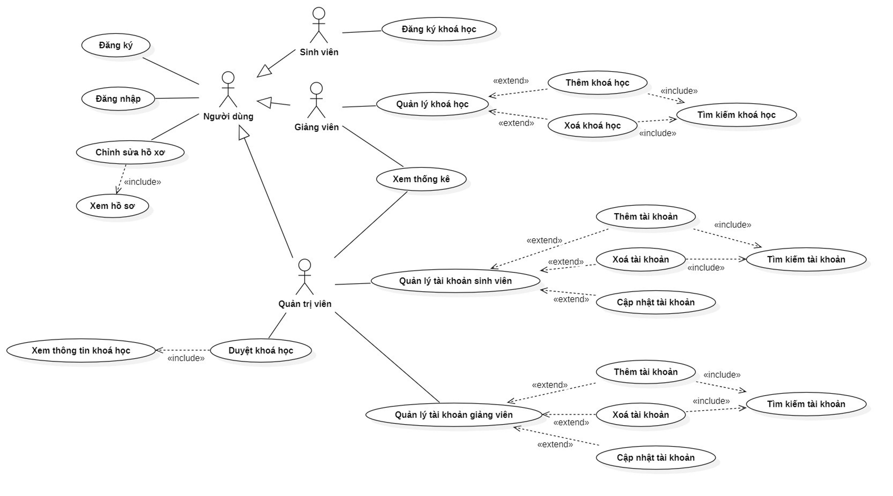

# Course Management Mobile Application

A full-stack mobile course management system developed using Spring Boot and Android, supporting JWT authentication, role-based access control, Redis-powered caching, and asynchronous media upload workflows integrated with RabbitMQ and Firebase Storage.
## Tech Stack

### Backend
- Spring Boot
- Spring Security
- JWT Authentication
- RESTful API Development

### Database
- MySQL
- Oracle Database

### Infrastructure
- Redis Caching
- RabbitMQ Message Broker
- Firebase Storage
- Docker

### Mobile
- Android Java

### Version Control
- Git & GitHub

## Demo Mobile Screen 
<table align="center">
  <tr>
    <td align="center">
       
      <b>Login</b>
    </td>
    <td align="center">
       
      <b>User Profile</b>
    </td>
    <td align="center">
       
      <b>Dashboard</b>
    </td>
     <td align="center">
       
      <b>Course Details</b>
    </td>
  </tr>
</table>

## System Flow Architecture

## ERD Diagram

## Use Case Diagram

## Key Features

- JWT-based authentication & role-based authorization
- Redis caching for API optimization
- Asynchronous media upload using RabbitMQ
- Firebase Storage integration
- RESTful API design
- Global exception handling
- DTO mapping with MapStruct
- Dockerized backend services
